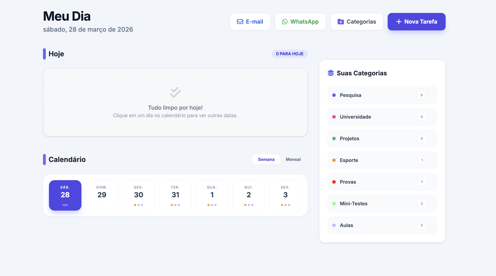

# 🗓️ Planner Pessoal 

Este projeto foi desenvolvido com o auxílio de Inteligência Artificial, focado no propósito de resolver problemas reais de organização de forma rápida e prática, priorizando a funcionalidade. Ele nasceu da necessidade de ter um controle claro das tarefas diárias, categorias e prazos, tudo rodando **100% localmente** na sua máquina.

---

## 📸 Demonstração

> [!TIP]
> 

---

## ✨ O que ele faz?

- **Gestão de Tarefas**: Adicione, edite e conclua tarefas com facilidade.
- **Categorias Personalizadas**: Organize sua rotina por contextos (Trabalho, Estudo, Lazer, etc).
- **Foco em Localhost**: Seus dados ficam com você. O projeto utiliza SQLite para persistência local.
- **Resumo por E-mail**: Envie suas tarefas pendentes diretamente para o seu e-mail.
- **Interface Intuitiva**: Design focado na produtividade e rapidez.

---

## 🛠️ Como Rodar Localmente

Siga os passos abaixo para colocar o seu Planner para funcionar:

### 1. Pré-requisitos
Certifique-se de ter o [Node.js](https://nodejs.org/) instalado em seu computador.

### 2. Instalação
No terminal, dentro da pasta do projeto, instale as dependências:
```bash
npm install
```

### 3. Configuração (Opcional - E-mail)
Se você quiser usar a função de envio de e-mail, crie um arquivo `.env` na raiz do projeto com as seguintes credenciais:
```env
EMAIL_USER=seu-email@gmail.com
EMAIL_PASS=sua-senha-de-app
```

### 4. Execução
Inicie o servidor local:
```bash
node server.js
```

### 5. Acesso
Abra o seu navegador e acesse:
👉 [http://localhost:3000](http://localhost:3000)

---

## 📂 Estrutura do Projeto
- `server.js`: O servidor do backend (Node.js + Express + SQLite).
- `public/`: Todo o frontend (HTML, CSS e JS modularizado).
- `planner.db`: Arquivo gerado automaticamente com seus dados.

